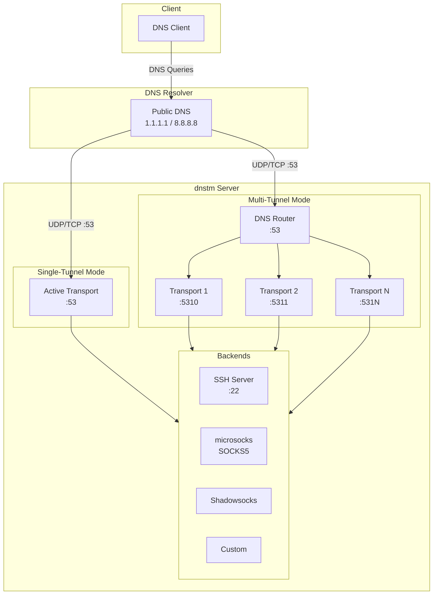

# DNS Tunnel Manager (dnstm)

A CLI tool to deploy and manage DNS tunnel servers on Linux. Run single tunnels or scale with the built-in DNS router for multi-tunnel setups. Configure via interactive menu, CLI commands, or config files with auto-generated certificates and keys.

## Supported Transports

| Transport          | Description                                                       |
| ------------------ | ----------------------------------------------------------------- |
| **VayDNS**         | Next-gen DNS tunnel with Curve25519 keys and KCP                  |
| **DNSTT**          | Classic DNS tunnel using Curve25519 keys                          |
| **Slipstream**     | High-performance DNS tunnel with TLS encryption                   |
| **MasterDnsVPN**   | Self-contained VPN provider with built-in SOCKS5 and encryption   |

## Supported Backends

| Backend         | Description                       | Transports                |
| --------------- | --------------------------------- | ------------------------- |
| **SOCKS**       | Built-in microsocks SOCKS5 proxy  | Slipstream, DNSTT, VayDNS |
| **SSH**         | Forward to local SSH server       | Slipstream, DNSTT, VayDNS |
| **Shadowsocks** | Encrypted proxy via SIP003 plugin | Slipstream only           |
| **Custom**      | Forward to any TCP address        | Slipstream, DNSTT, VayDNS |

> **Note:** MasterDnsVPN does not use a backend. It operates as a self-contained SOCKS5 VPN provider with its own built-in encryption, key management, and upstream DNS resolution.

## Features

- Two operating modes: single-tunnel and multi-tunnel (DNS router)
- Interactive menu and full CLI support
- Auto-generated TLS certificates (Slipstream) and Curve25519 keys (DNSTT, VayDNS)
- Shareable `dnst://` URLs for easy client setup (`tunnel share`)
- Firewall configuration (UFW, firewalld, iptables)
- systemd service management with security hardening
- SSH tunnel user management with sshd hardening
- Integrated microsocks SOCKS5 proxy with optional authentication
- MasterDnsVPN: self-contained VPN provider with configurable encryption (XOR, ChaCha20, AES), per-tunnel binary versioning, and live encryption key rotation

## System Overview



## Quick Start

### DNS Setup

Configure NS records pointing to your server:

```
ns.example.com.  IN  A   YOUR_SERVER_IP
t.example.com.   IN  NS  ns.example.com.
```

### Concepts

- **Backend**: Where traffic goes after decapsulation (socks, ssh, shadowsocks, custom)
- **Transport**: DNS tunnel protocol (slipstream, dnstt, or vaydns)
- **Tunnel**: A transport + backend + domain combination

> **Note:** Slipstream + Shadowsocks uses SIP003 plugin mode - the shadowsocks server runs as a plugin to slipstream, providing encrypted tunneling. This requires defining a shadowsocks backend instead of using the built-in socks proxy. DNSTT and VayDNS do not support Shadowsocks backends.

### Install

```bash
curl -sSL https://raw.githubusercontent.com/net2share/dnstm/main/install.sh | sudo bash
```

### Configuration Methods

#### 1. Interactive Menu

```bash
sudo dnstm
# Navigate: Tunnels → Add
```

#### 2. CLI Commands

```bash
# Add slipstream + socks tunnel
sudo dnstm tunnel add -t slip-socks --transport slipstream --backend socks --domain t1.example.com

# Configure SOCKS5 authentication (optional)
sudo dnstm backend auth -t socks --user myuser --password mypass

# Add dnstt + ssh tunnel
sudo dnstm tunnel add -t dnstt-ssh --transport dnstt --backend ssh --domain t2.example.com

# Add slipstream + shadowsocks tunnel (creates shadowsocks backend automatically)
sudo dnstm backend add -t my-ss --type shadowsocks --password mypass123 --method aes-256-gcm
sudo dnstm tunnel add -t slip-ss --transport slipstream --backend my-ss --domain t3.example.com

# Add vaydns + socks tunnel
sudo dnstm tunnel add -t vaydns-socks --transport vaydns --backend socks --domain t4.example.com

# Add vaydns tunnel with dnstt-compatible wire format
sudo dnstm tunnel add -t vaydns-compat --transport vaydns --backend socks --domain t5.example.com --dnstt-compat

# Add slipstream + custom backend (e.g., MTProto proxy)
sudo dnstm backend add -t mtproto --type custom --address 127.0.0.1:8443
sudo dnstm tunnel add -t slip-mtproto --transport slipstream --backend mtproto --domain t6.example.com

# Add MasterDnsVPN tunnel (no backend required)
sudo dnstm tunnel add -t vpn1 --transport masterdnsvpn --domain t7.example.com

# Change encryption method for a MasterDnsVPN tunnel
sudo dnstm tunnel set-encryption vpn1

# Change encryption on all MasterDnsVPN tunnels at once
sudo dnstm tunnel set-encryption-all

# Convert an existing tunnel to MasterDnsVPN
sudo dnstm tunnel convert vpn1 --to masterdnsvpn

# Convert all tunnels of a given transport to MasterDnsVPN
sudo dnstm tunnel convert-all --from vaydns --to masterdnsvpn

# Pin a specific MasterDnsVPN release version during install
sudo dnstm install --masterdnsvpn-version v2026.04.07.233605-b5a4474
```

#### 3. Config File

```bash
sudo dnstm config load config.json
```

Example `config.json` (certs/keys auto-generated when paths are omitted):

```json
{
  "backends": [
    {
      "tag": "socks",
      "type": "socks",
      "socks": {
        "user": "myuser",
        "password": "mypass"
      }
    },
    {
      "tag": "my-ss",
      "type": "shadowsocks",
      "shadowsocks": {
        "password": "mypass123",
        "method": "aes-256-gcm"
      }
    },
    {
      "tag": "mtproto",
      "type": "custom",
      "address": "127.0.0.1:8443"
    }
  ],
  "tunnels": [
    {
      "tag": "slip-socks",
      "transport": "slipstream",
      "backend": "socks",
      "domain": "t1.example.com",
      "port": 5310,
      "slipstream": {
        "cert": "/path/to/cert.pem",
        "key": "/path/to/key.pem"
      }
    },
    {
      "tag": "slip-ss",
      "transport": "slipstream",
      "backend": "my-ss",
      "domain": "t2.example.com",
      "port": 5311
    },
    {
      "tag": "dnstt-ssh",
      "transport": "dnstt",
      "backend": "ssh",
      "domain": "t3.example.com",
      "port": 5312,
      "dnstt": {
        "mtu": 1232
      }
    },
    {
      "tag": "vaydns-socks",
      "transport": "vaydns",
      "backend": "socks",
      "domain": "t4.example.com",
      "port": 5313,
      "vaydns": {
        "mtu": 1232,
        "idle_timeout": "10s",
        "keep_alive": "2s",
        "clientid_size": 2,
        "queue_size": 512,
        "record_type": "txt"
      }
    },
    {
      "tag": "vaydns-compat",
      "transport": "vaydns",
      "backend": "ssh",
      "domain": "t5.example.com",
      "port": 5314,
      "vaydns": {
        "dnstt_compat": true,
        "mtu": 1232
      }
    },
    {
      "tag": "slip-mtproto",
      "transport": "slipstream",
      "backend": "mtproto",
      "domain": "t6.example.com",
      "port": 5315
    },
    {
      "tag": "vpn1",
      "transport": "masterdnsvpn",
      "domain": "t7.example.com",
      "port": 5316,
      "masterdnsvpn": {
        "config_file": "/etc/dnstm/tunnels/vpn1/server_config.toml",
        "binary_path": "/etc/dnstm/tunnels/vpn1/masterdnsvpn-server"
      }
    }
  ],
  "route": {
    "mode": "multi",
    "default": "slip-socks"
  }
}
```

### Share with Client

Generate a `dnst://` URL to share tunnel configuration with [dnstc](https://github.com/net2share/dnstc):

```bash
# SOCKS or Shadowsocks tunnel
sudo dnstm tunnel share -t slip-socks

# SSH tunnel (requires credentials)
sudo dnstm tunnel share -t dnstt-ssh --user tunnel-user --password secret
```

### Common Commands

```bash
sudo dnstm router status          # View router and tunnel status
sudo dnstm tunnel list            # List all tunnels
sudo dnstm tunnel share -t <tag>  # Generate shareable client config URL
sudo dnstm tunnel logs -t <tag>   # View tunnel logs
sudo dnstm router logs            # View router logs (multi-mode)
sudo dnstm update                 # Check for and install updates
sudo dnstm uninstall              # Remove all components
```

See [CLI Reference](docs/CLI.md) for all available flags and options.

## MasterDnsVPN

MasterDnsVPN is a self-contained VPN provider transport. Unlike other transports it does not require a DNSTM backend — it runs its own SOCKS5 proxy, handles encryption, and resolves upstream DNS internally.

### How it differs from other transports

| Feature              | MasterDnsVPN          | Slipstream / DNSTT / VayDNS |
| -------------------- | --------------------- | --------------------------- |
| Backend required     | No                    | Yes                         |
| Encryption           | Built-in (0–5 methods)| Depends on backend          |
| Key management       | Auto-generated, rotatable | Curve25519 / TLS cert   |
| Client config format | Domain + Encryption Key | `dnst://` URL             |
| Per-tunnel binary    | Yes (version-pinnable)| No                          |
| Upstream DNS         | Configurable (default: Cloudflare + Quad One) | Via backend |

### Encryption methods

| Value | Method   |
| ----- | -------- |
| 0     | None     |
| 1     | XOR      |
| 2     | ChaCha20 |
| 3–5   | AES variants |

Change the encryption method (and rotate the key) at any time:

```bash
sudo dnstm tunnel set-encryption vpn1
# Follow the prompt to select a method; the new key is printed for client use
```

### Files created per tunnel

```
/etc/dnstm/tunnels/{tag}/
├── server_config.toml       # TOML config (updated automatically on mode switches)
├── encrypt_key.txt          # Encryption key (regenerated on key rotation)
└── masterdnsvpn-server      # Per-tunnel binary copy

/etc/dnstm/.masterdnsvpn-version  # Installed release tag (shared)
```

### Sharing with a client

`tunnel share` outputs the domain and encryption key instead of a `dnst://` URL:

```bash
sudo dnstm tunnel share -t vpn1
# Output: domain and encryption key to paste into the client config
```

### Version management

During install or upgrade you can pin a specific MasterDnsVPN release. The version is stored in `/etc/dnstm/.masterdnsvpn-version` and each tunnel keeps its own binary copy, so tunnels are unaffected by global upgrades until you explicitly re-setup or convert them.

```bash
# Install with a specific version
sudo dnstm install --masterdnsvpn-version v2026.04.07.233605-b5a4474

# Skip MasterDnsVPN installation entirely
sudo dnstm install --masterdnsvpn-version skip
```

## Operating Modes

### Single-Tunnel Mode (Default)

One tunnel active at a time. The active transport binds directly to port 53.

```bash
sudo dnstm router mode single
sudo dnstm router switch -t <tag>
```

### Multi-Tunnel Mode

All tunnels run simultaneously. DNS router handles domain-based routing.

> **Note:** Multi-mode overhead is typically minimal. Performance varies by transport and connection method. See [Benchmarks](docs/BENCHMARKS-v0.5.0.md) for details.

```bash
sudo dnstm router mode multi
```

## Documentation

- [Architecture](docs/ARCHITECTURE.md) - System design and operating modes
- [CLI Reference](docs/CLI.md) - Complete command reference
- [Configuration](docs/CONFIGURATION.md) - Configuration files and options
- [Client Setup](docs/CLIENT.md) - Client-side connection guides
- [Development](docs/DEVELOPMENT.md) - Action-based architecture and adding commands
- [Testing](docs/TESTING.md) - Testing guide and remote test setup
- [Benchmarks](docs/BENCHMARKS-v0.5.0.md) - Performance benchmarks

## Requirements

- Linux (Debian/Ubuntu, RHEL/CentOS/Fedora)
- Root access
- systemd
- Domain with NS records pointing to your server

## Building from Source

```bash
git clone https://github.com/net2share/dnstm.git
cd dnstm
go build -o dnstm .
```
